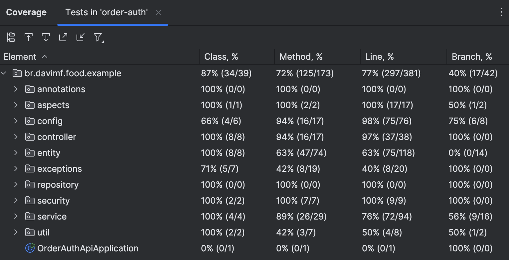

# Project Backlog

This document outlines the next steps for the Food Delivery API project, categorized by type.

## Bugs

* **BUG - Resolve Idempotency Issue in Token Generation:**
    * Investigate and resolve errors caused by rapid consecutive token generation requests at
      `/auth/authenticate` by implementing an idempotency strategy.

* **BUG - Enhance API Documentation with Swagger/OpenAPI:**
    * Refine and expand API documentation using Swagger/OpenAPI to ensure comprehensive coverage,
      clarity, and usability for developers.

## Issues

* **ISSUE - Implement Tests for Refresh Token Functionality:**
    * Develop comprehensive tests for the refresh token functionality to ensure its reliability and
      security.

* **ISSUE - Increase Integration Test Coverage to 90%:**
    * Increase integration test coverage to at least 90%, up from approximately 70% currently, to
      improve overall application robustness.
      

* **ISSUE - Integrate Code Coverage and Formatting Validation Plugins:**
    * Integrate plugins to automatically validate code coverage, enforce consistent code
      formatting, and finding vulnerabilities during the build process.

* **ISSUE - Develop Unit and Behavior-Driven Tests:**
    * Develop a comprehensive suite of unit tests (JUnit) and behavior-driven tests (BDD using
      Mockito) to ensure code correctness.

## Evolutions

* **EVOLUTION - Enhance C4 Architectural Model:**
    * Expand the C4 architectural model to provide a more detailed and accurate representation of
      the system's structure.

* **EVOLUTION - Implement Asynchronous Order Processing with Message Queue:**
    * Implement a message queue to asynchronously process new orders, decoupling the API from the
      order processing worker for improved user experience.

* **EVOLUTION - Implement Command Query Responsibility Segregation (CQRS):**
    * Implement Command Query Responsibility Segregation (CQRS) to optimize database interactions
      for read and write operations, including database optimization (indexing, query optimization,
      connection pooling).

* **EVOLUTION - Implement Audit Logging:**
    * Implement comprehensive audit logging using interceptors or Spring Data's audit aware
      functionality to track changes and actions within the system.

* **EVOLUTION - Implement Caching for Frequently Accessed Data:**
    * Implement caching for frequently accessed data (users, tokens, etc.) to improve performance
      and reduce database load.

* **EVOLUTION - Implement Token Storage with Cache or NoSQL Database:**
    * Explore and implement a caching mechanism or NoSQL database to efficiently manage and store
      tokens.

* **EVOLUTION - Enhance Scalability Beyond RPM:**
    * Enhance scalability beyond RPM by incorporating auto-scaling based on resource utilization (
      CPU, memory, disk), load balancing, and container orchestration (Kubernetes).

* **EVOLUTION - Implement Monitoring and Alerting:**
    * Implement robust monitoring and alerting to proactively identify and address performance and
      stability issues.

* **EVOLUTION - Split Application into Microservices:**
    * Divide the application into two distinct microservices to improve modularity, independent
      scalability, maintainability, technology diversity, and fault isolation:
        * **Authentication/User Management Service:** Manages user registration, authentication, and
          user profiles, scaling independently based on user load.
        * **Order Management Service:** Handles all order-related operations, scaling independently
          based on order volume and processing demands.

## Product Backlog

* **PRODUCT - Create Messaging Topic for Cross-Domain Communication:**
    * Define and create a messaging topic to publish relevant information for consumption by other
      domains.

* **PRODUCT - Integrate OAuth2 with Google Provider:**
    * Integrate OAuth2 with Google provider to simplify user authentication and accelerate product
      launch.
