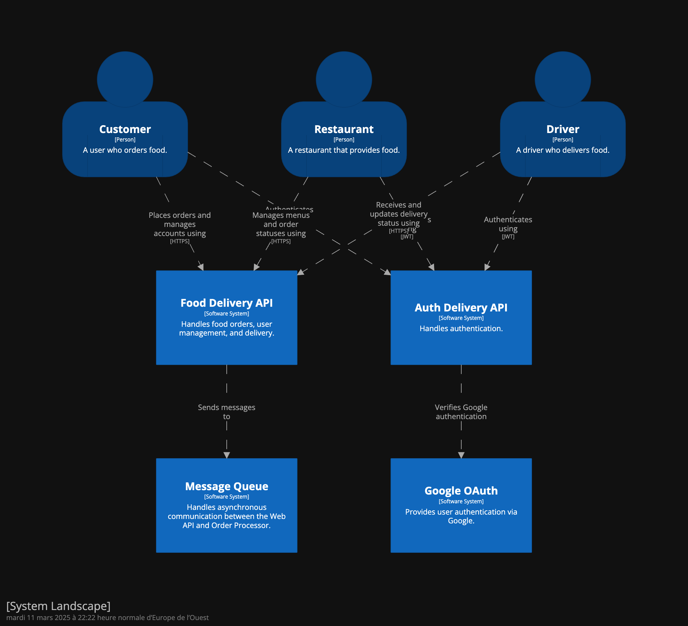
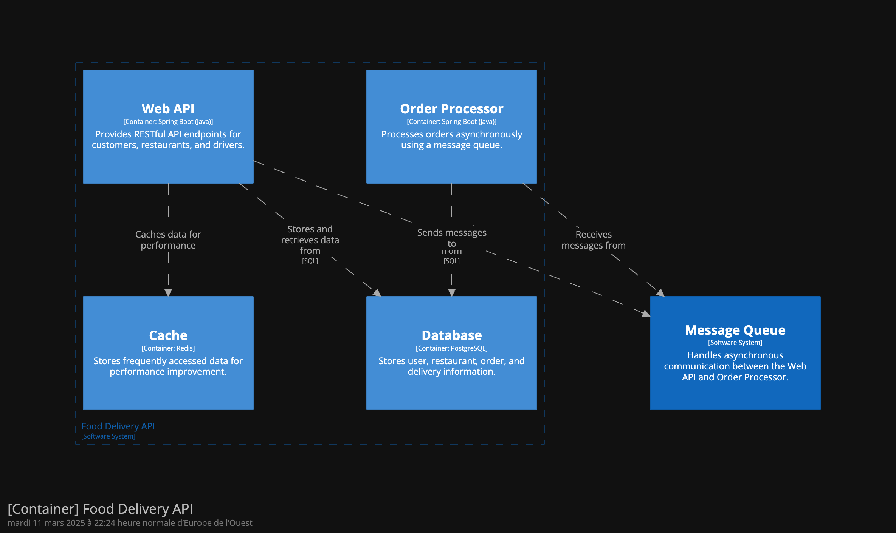
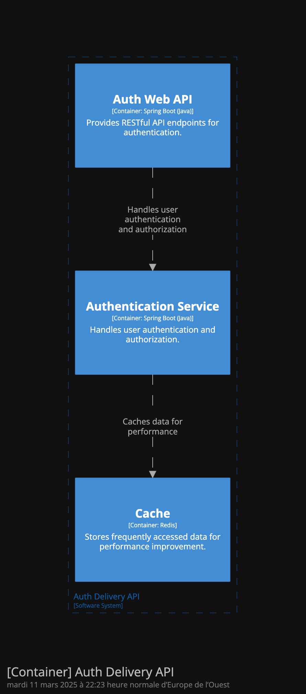

# Architecture Decision Record (ADR01)

# 1. Choosing Core Technologies for the Food Delivery API MVP

* **Status:** Proposed
* **Date:** 2025-03-10
* **Deciders:** davimf

## Context

For the initial Minimum Viable Product (MVP) of the Food Delivery API, we need to select core
technologies that provide a balance between rapid development, essential functionality, and future
scalability.

## Decision

We have decided to use the following technologies for the MVP:

* **Database:** PostgreSQL (SQL)
* **Scalability:** RPM (Requests Per Minute) based scaling
* **Security/Authorization:** JSON Web Tokens (JWT)

## Rationale

### PostgreSQL (SQL)

* **Integrity and Consistency:** SQL databases, particularly PostgreSQL, offer strong data integrity
  and consistency, which are crucial for managing orders and user data.
* **Spring Boot Integration:** Spring Boot provides excellent support for PostgreSQL, simplifying
  database interactions and development.
* **Pagination and Querying:** SQL databases excel at handling complex queries and pagination, which
  will be essential for managing large datasets as the application grows.
* **Simplicity:** For an MVP, Postgres is very simple to setup, and very well documented.

### RPM (Requests Per Minute) Based Scaling

* **MVP Focus:** For an MVP, focusing on scaling based on the number of requests ensures that the
  application can handle a reasonable load of users.
* **Simplicity:** RPM scaling is relatively straightforward to implement and monitor.
* **Cost-Effectiveness:** It allows us to optimize resource usage based on actual traffic patterns.
* **Future Scalability:** While not the most advanced scaling strategy, it provides a solid
  foundation for future scalability by allowing us to easily increase resource allocation as needed.

### JSON Web Tokens (JWT)

* **Role-Based Authorization:** JWTs enable us to implement role-based authorization, allowing us to
  differentiate between user and driver access levels.
* **Stateless Authentication:** JWTs are stateless, which simplifies server-side authentication
  logic and improves scalability.
* **Spring Security Integration:** Spring Security provides excellent support for JWTs, simplifying
  the implementation of secure authentication.
* **Standardization:** JWT is a widely adopted standard, ensuring interoperability and ease of use.

### Gateway and Enhanced Security: Kong API Gateway

* **Centralized Security Management:** Kong simplifies security administration and enforcement
  through its rich plugin ecosystem, providing a centralized point for managing security policies,
  including authentication, authorization, and rate limiting.
* **Rate Limiting Implementation:** Rate limiting will be implemented at the Kong gateway level to
  protect our APIs from abuse, such as DoS attacks and excessive usage from malicious actors, and
  ensure fair usage.
    - Will be configured based on requests per minute, with dynamic adjustments based on real-time
      traffic patterns and anomaly detection.
    - Will be configured based on requests per IP, user, or other entity related, providing granular
      control over usage.
* **Extensibility and Scalability:** Kong is highly extensible and scalable, ensuring that our
  security infrastructure can grow with our application, accommodating increasing traffic and
  complexity.

## Consequences

### PostgreSQL (SQL)

* **Relational Data:** We will need to design a relational database schema to represent our data.
* **Learning Curve:** Developers unfamiliar with SQL may require some time to learn.

### RPM (Requests Per Minute) Based Scaling

* **Limited Elasticity:** RPM scaling may not be as elastic as more advanced scaling strategies.
* **Monitoring:** We will need to implement monitoring to track request rates and adjust resource
  allocation accordingly.

### JSON Web Tokens (JWT)

* **Security Considerations:** We will need to implement proper security measures to protect JWTs
  from attacks.
* **Token Management:** We will need to implement a strategy for managing token expiration and
  revocation.

### Gateway and Enhanced Security: Kong API Gateway

* **Configuration Management:** Kong's setup requires careful planning and version control to
  prevent vulnerabilities.
* **Operational Monitoring:** Kong introduces overhead, necessitating robust logging and alerting
  systems.
* **Continuous Evaluation:** The alternative cloud native gateways (AWS API Gateway, Azure API
  Management, and Google Cloud Apigee) will be periodically reviewed for optimal fit, cost, and
  cloud integration.

## C4 model

These diagrams represent the current system, excluding cache, OAuth2 integration, and Kong
integration, all of which are planned for future development beyond the MVP.

* **Model**
  

* **Order API**
  

* **Auth API**
  

We leveraged the official [C4 model website](https://c4model.com/diagrams/example) for reference and
the [Structurizr DSL generator](https://structurizr.com/dsl) to implement
this [C4 model dsl](../c4-model/ADR_01.dsl).

## Further Considerations

* We will evaluate more advanced scaling strategies as the application grows.
* We will continuously monitor and optimize database performance.
* We will conduct regular security audits to ensure the security of our authentication system.
